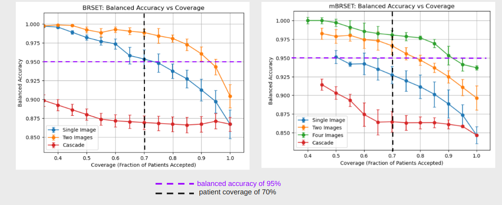

# SureSight
## Confidence-Guided Multi-Image Fusion for Diabetic Retinopathy Screening

SureSight is a deep learning pipeline for reliable diabetic retinopathy (DR) screening from retinal fundus images, designed for deployment on mobile retinal imaging devices.

The system integrates:

- confidence-aware image filtering  
- multi-image prediction fusion  
- patient-level confidence decisions  

to improve diagnostic reliability when screening patients using smartphone-based retinal cameras.

This approach is designed for real-world screening environments where image quality may vary significantly and reliable automated diagnosis is critical.

---

## Motivation

Early screening for diabetic retinopathy is critical because many eye diseases progress asymptomatically until irreversible vision loss occurs. A large proportion of global blindness occurs in low- and middle-income regions, where access to specialized ophthalmological care is limited.

Recent AI models show strong performance on curated datasets but often struggle when deployed in real screening settings due to:

- blur and motion artifacts  
- uneven illumination  
- occlusions  
- variability in image capture  

SureSight addresses this by combining confidence-aware filtering and multi-image fusion to produce more reliable patient-level predictions.

---

## SureSight Pipeline

The SureSight system processes retinal images through several stages.

### Image-Level Prediction

Each fundus image is passed through a diagnosis model that outputs a probability of diabetic retinopathy.

### Image Confidence Filtering

Images are retained only if the model prediction is confident toward either class.  
Low-confidence images are discarded.

### Multi-Image Fusion

If multiple retinal images are available for a patient, predictions are aggregated using mean probability fusion.

This reduces the impact of noisy predictions and improves overall reliability.

### Patient-Level Decision

A final diagnosis is produced only when the aggregated patient probability is sufficiently confident.

If the system is not confident, additional images can be captured during screening.

---

## Datasets

SureSight is designed to work with retinal datasets such as:

### mBRSET
Mobile Brazilian Multilabel Ophthalmological Dataset

- 5,164 fundus images  
- 1,291 patients  
- Images captured using smartphone-based retinal cameras

### BRSET
Brazilian Multilabel Ophthalmological Dataset

- 16,266 clinical fundus images  
- 8,524 patients  

Data is split at the patient level to prevent leakage between training and validation sets.

---

## Model

SureSight uses **RETFound-Green**, a retinal foundation model trained on large retinal datasets and optimized for efficient inference.

The model is fine-tuned for:

- diabetic retinopathy diagnosis  
- image quality classification  

The same backbone architecture is used for both tasks.

---

## Repository Files

model.py:
Defines the neural network architecture used in the project. The UnifiedBackbone class wraps the RETFound backbone with a classification head and is used for both image quality classification and diabetic retinopathy diagnosis.

fundus_dataset.py:
Implements the PyTorch dataset used to load retinal images. Handles reading images, applying transforms, and returning tensors and labels.

img_quality_train_val.py:
Contains training and evaluation for the image quality classifier.

diagnosis_train_eval.py:
Implements training and evaluation functions for the diabetic retinopathy diagnosis model and computes metrics such as balanced accuracy, F1 score, and AUC.

multi_image_val_test.py:
Provides utilities for evaluating multi-image fusion methods and aggregating predictions across multiple retinal images from the same patient.

LoadAndProcessingBRSET.ipynb:
Notebook used for dataset preprocessing and patient-level data splitting for the BRSET dataset.

train_disease_diagnosis_model.ipynb:
Notebook used to train the diabetic retinopathy diagnosis model.

img_quality_diagnosis_cascade.ipynb:
Runs the cascaded pipeline experiment where the image quality model filters images before they are passed to the diagnosis model.

multi_image_fusion.ipynb:
Notebook used to evaluate different multi-image prediction fusion strategies. 

## Main Conclusions
## Results

### Coverage vs Balanced Accuracy (BRSET and mBRSET respectively)

Compared to the RETFound-Green baseline at 100% coverage (87% BA on BRSET, 85% on mBRSET), SureSight achieves +3% and +9% balanced accuracy gains respectively at 100% coverage, and reaches over 97% BA on both datasets at 70% coverage.

 

